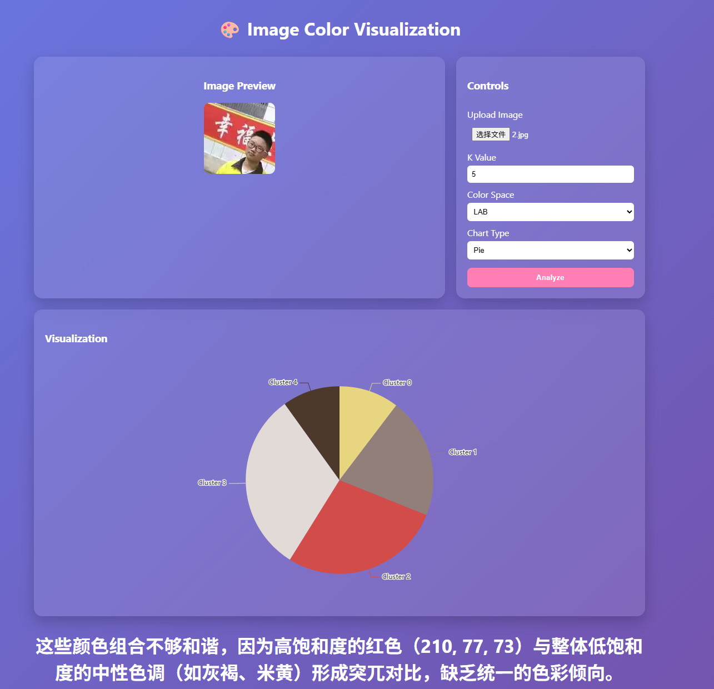
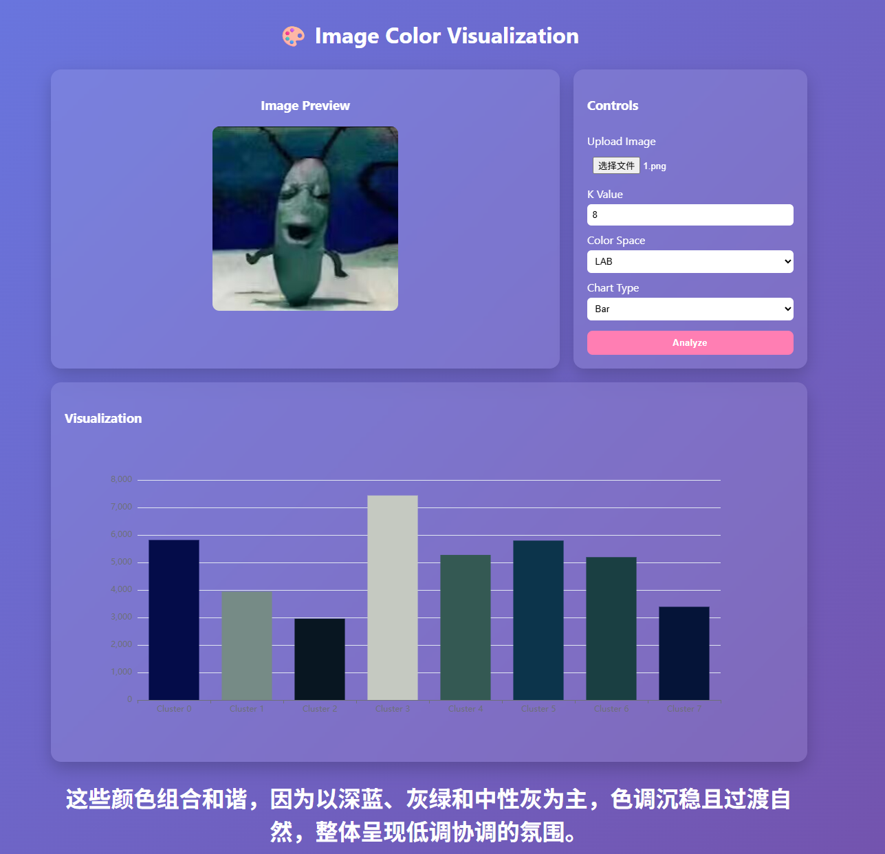

# 🎨 图片颜色聚类可视化

> 基于 K-Means + AI 的图片主色调分析与可视化系统

[](https://www.python.org/)
[](https://flask.palletsprojects.com/)
[](https://echarts.apache.org/)

## 🌐 在线演示

🔗 **GitHub Pages**：https://hoshino-0102.github.io/color-visualization/

> ⚠️ 注意：GitHub Pages 仅展示前端静态页面，完整功能需本地运行后端服务。

## 📸 效果预览

<p align="center">
  
  
</p>

## ✨ 功能特点

- 🖼️ 图片上传与实时预览
- 🎯 K-Means 智能聚类提取主色调
- 📊 饼图 / 柱状图切换展示
- 🎨 RGB / LAB 双颜色空间支持
- ⚙️ 交互式调节聚类数量 K
- 🤖 AI 大模型色彩和谐度评价

## 🛠️ 技术栈

| 前端 | 后端 | 算法 | AI |
|------|------|------|-----|
| HTML5 · CSS3 · JS · ECharts | Python · Flask | Scikit-learn · scikit-image | DeepSeek API |

## 📁 项目结构

```
├── backend/          # Flask 后端
├── frontend/         # 前端页面
├── screenshots/      # 效果截图
└── README.md
```

## 🚀 本地运行

```bash
# 克隆项目
git clone https://github.com/Hoshino-0102/color-visualization.git
cd color-visualization

# 安装依赖
cd backend
pip install flask flask-cors pillow numpy scikit-learn scikit-image python-dotenv openai

# 配置 API（创建 backend/.env）
echo "DEEPSEEK_API_KEY=你的密钥" > .env

# 启动后端
python app.py

# 新终端启动前端
cd frontend
python -m http.server 8000
```

访问 http://localhost:8000/index.html

## 🌍 GitHub Pages 部署

本项目前端已部署于 GitHub Pages，部署步骤如下：

1. 仓库 → Settings → Pages
2. Source 选择 `Deploy from a branch`
3. Branch 选择 `main`，文件夹选择 `/frontend`（或 `/docs`）
4. 保存后等待部署完成

## 📖 使用说明

1. 上传图片
2. 设置 K 值（3-10）
3. 选择颜色空间（RGB/LAB）和图表类型（饼图/柱状图）
4. 点击「Analyze」查看结果

## 📊 课程要求完成度

| 要求项 | 状态 |
|--------|------|
| K-Means 聚类（K ≥ 5） | ✅ |
| 显示颜色均值与数量 | ✅ |
| ECharts 可视化 | ✅ |
| 交互调整 K 值 | ✅ |
| 多图片支持 | ✅ |
| 图表类型切换 | ✅ |
| RGB/LAB 切换 | ✅ |
| AI 大模型颜色评价 | ✅ |
| GitHub Pages 部署 | ✅ |

## 🙋‍♂️ 作者

**郭炫麟** · 10245102503 · 数据可视化 2026

---

⭐ 如果对你有帮助，欢迎 Star！